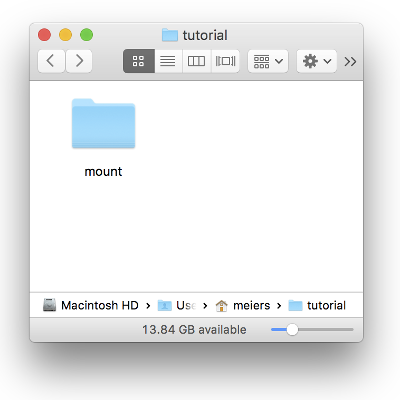
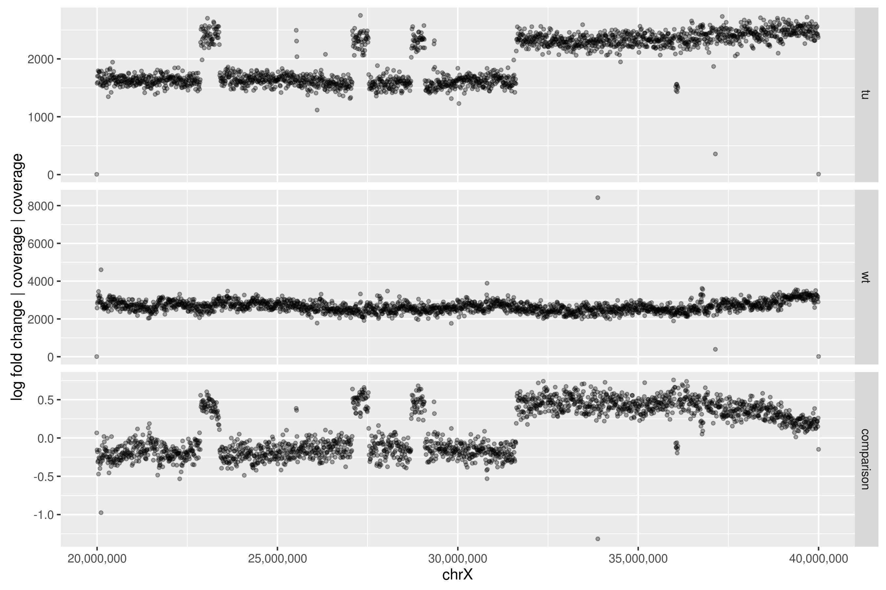
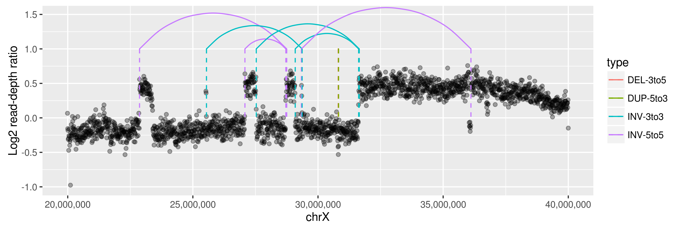
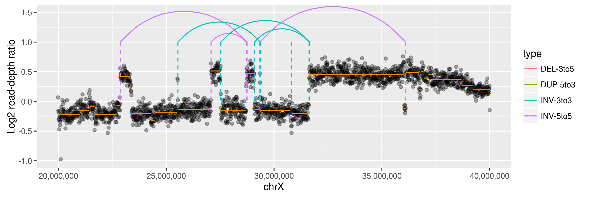

# SV calling tutorial 2016

This tutorial provides a short introduction into **structural variant** detection in a **cancer genome**. It is aimed primarily at PhD students of the *EMBL Predoc course* and tighly follows Tobias Rausch's original [SV calling tutorial](https://github.com/tobiasrausch/tutorial-delly) (version from June, 2016), as well as an internal tutorial from the Korbel lab at EMBL.

## Scope of this tutorial

In this practical we will analyse large (in the sense of structural) genetic variation in a cancer patient's genome. 

DNA from a cancer cell line derived from a tumor was isolated as well as from blood (as control sample), processed with a whole-genome sequencing paired-reads protocol and sequenced on an Illumina sequencer.
During the practical you will be guided through some typical analysis steps:

 * Setting up the software
 * Raw sequencing data & QC
 * Read depth analysis
 * SV calling with Delly
 * Visualization of SV calls

## Setting up the software

Luckily, nearly all the software we are going to need is pre-packaged in a [Docker](https://www.docker.com/) image. This saves you the effort to run through a lot of installation processes and solves all dependecy issues (except, of course, Docker itself).

### Installing Docker on Linux

Docker is based on Linux, so that's its natural environment. On Ubuntu for example installation is simple, you just need add another repository to apt. Instructions can be found [here](https://docs.docker.com/engine/installation/).

### Installing Docker on Mac

Docker supports Mac and the installation is quite easy if all prerequisites (e.g. a OS X 10.10) are met. Download the installer from the [Docker website](https://docs.docker.com/docker-for-mac/) and drag & drop the app into your Applications folder.

### Run a Docker container

The Docker container ships with software and data needed for this tutorial. First, open a terminal and create a folder (e.g. `tutorial`) to work in

```
$ cd
$ mkdir tutorial
$ cd tutorial
```

Now download the Docker image via

```
$ docker pull trausch/tutorial-delly
```

We can run the image with the `docker run` command. There are options to also connect a graphical display; however I am usually fine with file access. To that end, we add a command to mount a folder from the host (your computer) into the Docker image (inside a virtual machine).

```
$ docker run -itv ~/tutorial/mount:/data/cldata/host trausch/tutorial-delly
```

This will create a folder `mount` in your computer's file system which is connected to the folder `/data/cldata/host` inside the docker image.

Now also I recommend opening this folder already in your computer, we will need it later.



Finally you should be within the Docker environment. There is a list of software tools shipped with this image in the appendix.


## Raw sequencing data & QC

In this part we will have a look at the raw data (in *bam* files) and check a few quality statistics. Note that certains tasks precede this step, such as read mapping with [bwa](https://github.com/lh3/bwa), which we skip in the interest of time.

Now let's move into the `cldata` folder:

```
$ cd /data/cldata
```

You will find the aligned sequencing reads within *bam* files, which is the binary version of the *sequence alignment map (sam)* format.

```
$ ls *.bam
tu.bam  wt.bam
```

Those refer to the **tumor** sample and a control.
In order to take a look at the content you need [samtools](https://github.com/samtools/samtools)

```
$ samtools view tu.bam | less -S
```

### The *sam/bam* format

```
HWI-ST1146:203:C4VPEACXX:5:2102:9284:5253	99	chrX	19999918	60	100M	=	20000059	241	TATGAAATGTCCAGAATAAGCAAATCCATAGAAATAAAAAGTAGACTGGTGGTTGCCTGGGTGGGAGAAGGGGTGGGGGGATGAGAAATGATGGCTAATG	CCCFFFFFHHHHHJJJJJJJJJJJJJJJJJJJJJJJJJJJJCHHIIJJJHGIHIJJJJJJJBFHJDHEEEFFD3;?BDDD>>BDDDDDDDDDDDDDDDDD	MD:Z:100	RG:Z:TRG1	NM:i:0	AS:i:100	XS:i:0
HWI-ST1146:203:C4VPEACXX:6:1304:11511:83544	99	chrX	19999919	60	100M	=	20000101	282	ATGAAATGTCCAGAATAAGCAAATCCATAGAAATAAAAAGTAGACTGGTGGTTGCCTGGGTGGGAGAAGGGGTGGGGGGATGAGAAATGATGGCTAATGG	CCCFFFFFFHFHHJJJJJJIJJGJJIIJIJGJGIJJJJJJ@DGEHHIJ?FGIEHIJJJII=@AGCEBEEFFF>?D=BDD@<BDDDDDDDDDCDDDDDDDD	MD:Z:100	RG:Z:TRG1	NM:i:0	AS:i:100	XS:i:0
HWI-ST1146:203:C4VPEACXX:6:2116:14364:64142	99	chrX	19999923	60	100M	=	20000067	244	AATGTCCAGAATAAGCAAATCCATAGAAATAAAAAGTAGACTGGTGGTTGCCTGGGTGGGAGAAGGGGTGGGGGGATGAGAAATGATGGCTAATGGGCAC	@CCFDFFFHHHHHIJJJJJIJJJJIJIJJJJJJJJICFHIIJJJ?DHGHIJJJJJJ=BGIDGAEEHHF,9?BDDD>BBCCCCDDDDDDCDDDDDDDBAC@	MD:Z:100	RG:Z:TRG1	NM:i:0	AS:i:100	XS:i:0
...
```

What you see here are read *alignment*, one per line, in the [SAM](http://www.htslib.org/doc/#manual-pages) format. The fields present in every bam alignment record are explained below:

| Col   | Field    | Description                              |
|-------|----------|------------------------------------------|
|  1    |   QNAME  |    Query template NAME                   |
|  2    |   FLAG   |    bitwise FLAG                          |
|  3    |   RNAME  |    Reference sequence NAME               |
|  4    |   POS    |    1-based leftmost mapping POSition     |
|  5    |   MAPQ   |    MAPping Quality                       |
|  6    |   CIGAR  |    CIGAR string                          |
|  7    |   RNEXT  |    Ref. name of the mate/next read       |
|  8    |   PNEXT  |    Position of the mate/next read        |
|  9    |   TLEN   |    observed Template LENgth              |
|  10   |   SEQ    |    segment SEQuence                      |
|  11   |   QUAL   |    ASCII of Phred-scaled base QUALity+33 |

Note that for each read pair from a paired-end sequencing protocol there are usually two entries with the same read name (*QNAME*) - for reads 1 and 2 of the pair. However, some reads can be missing (for example because they did not pass certain quality controls) and there can be **multiple alignments** for a single read. 

Much of this information is encoded in a bitwise bitwise FLAG, which  can be decoded using the [explain flag tool](https://broadinstitute.github.io/picard/explain-flags.html) from the Picard distribution.

Besides the alignments, a *bam* file contains a header with additional information:

```
$ samtools view -H tu.bam | less -S
```

Importantly, there should be a **read group** (`@RG`) with a sample name (`SM`) assigned to the alignments. This will be used during the structural variant calling with Delly to distinguish samples in the multi-sample mode.

<details> 
  <summary>**Excercise**: Is this a full human genome data set?</summary>
> Only 20Mb on chromosome X (column 3 and 4).
</details>

<details> 
  <summary>**Excercise**: What is the read length used?</summary>
> Column 10 shows the sequenced read, it's a 100bp in the 
> tumor and 125bp in the control. This is also reported by 
> stats (e.g. `less tu.stats`).
</details>

<details> 
  <summary>**Excercise**: Check the sample names</summary>
> They are *tu* and *wt*.
</details>

<details> 
  <summary>**Excercise**: By looking at the header lines, can you find out which version of the human reference genome reads were aligned against?</summary>
> The `@PG` line gives some information on the program 
> used to map reads. From that line you can identify 
> the reference genome called `hs37d5.fasta`, which 
> stands for *homo sapiens* assembly 37, version 5 
> and is the referene genome used in the 
> [1000 Genomes project](http://www.internationalgenome.org/).
</details>

### Alignment statistics

General statistics of what is in the bam files can be generated with *samtools*:

```
$ samtools flagstat tu.bam
$ samtools flagstat wt.bam
```
There are some general things to watch out for such as mapping percentages below 70% or >20% duplicates. For more QC statistics we recommend [fastQC](http://www.bioinformatics.babraham.ac.uk/projects/fastqc/) (not covered here).

### Insert size distribution

One important QC step for paired-end sequencing data is to check the insert size (i.e. fragment length) distribution, which is given in column 8 of the *bam* file. Delly ships with a tool called [stats](https://github.com/tobiasrausch/bamstats) that does the work for us. It also provides an R script to visualize the results:

```
$ stats -o tu.stats -i tu.ins tu.bam
$ Rscript /opt/delly/R/isize.R tu.ins
$ stats -o wt.stats -i wt.ins wt.bam
$ Rscript /opt/delly/R/isize.R wt.ins
$ mv *.ins.png host/
```

Note that we sent the output plots to the special `host` folder, so they should appear in your `mount` folder on the computer. What do they tell you?


## Read depth analysis

We are going to use the coverage of mapped reads in a comparison between cancer genome and control to detect large-scale copy number alterations. This is a critical step as many cancer genomes are scarred with large copy number variants, chromosome arm losses or amplifications of oncogenes.

To generate the coverage you can use the [cov](https://github.com/tobiasrausch/delly) tool that comes with Delly. By default it calculates the coverage in 10kb bins, which gives us reasonable resolution. Smaller bin sizes increase the variance.

```
$ cov -f tn.cov.gz tu.bam wt.bam
```
We use R to plot the coverage. Feel free to write your own code if you know R. Otherwise, open an R session (type `R`) and copy-paste the following code.

```
library(ggplot2)
library(reshape2)
library(scales)

cov = read.table("tn.cov.gz", comment.char="$", header=T)
cov = cov[cov$wt!=0,c("start","end","tu","wt")]
covNorm = median(cov$wt) / median(cov$tu)
cov$comparison = log2(covNorm*cov$tu/cov$wt)
cov.3 = melt(cov, id.vars=c("start", "end"))

p = ggplot(cov.3, aes(x=start, y=value)) + 
	geom_point(alpha=1/3) + 
	xlab("chrX") + ylab("log fold change | coverage | coverage") + 
	facet_grid(variable ~ ., scales="free") + 
	scale_x_continuous(labels = comma)
ggsave("host/cov.pdf", width=9, height=6)
```



You can save the R session to reuse it later.

<details> 
  <summary>**Excercise**: Why is the comparison plot never at 0, meaning no copy number change between tumor and control?</summary>
> As you see in the code normalizaiton depends on the median 
> coverage of both samples - this is meant to correct for 
> different sequencing coverages in the two samples. 
> 
> We have selected a small region 
> of the chromosome with many copy changes, so likely the 
> median is already not a good proxy for average coverage 
> of the chromosome. Thus it is most likely a technical 
> problem, not biology.
</details>


## SV calling with Delly

To gain a **high resolution** of copy number variants, but also to detect **other classes of SV** such as inversions, tools like [Delly](https://github.com/tobiasrausch/delly) use discordantly mapping paired-end reads or reads that are split and mapped to two locations in the genome. In this part of the tutorial we will run Delly on our samples and filter for somatic variants.

The `delly call` command can predict SVs in multiple samples at the same time:

```
delly call -t DEL -g chrX.fa -x hg19.ex -o del.bcf tu.bam wt.bam
delly call -t DUP -g chrX.fa -x hg19.ex -o dup.bcf tu.bam wt.bam
delly call -t INV -g chrX.fa -x hg19.ex -o inv.bcf tu.bam wt.bam
```

Note that it needs a reference genome (via `-g`).

With [bcftools](https://github.com/samtools/bcftools), which is again pre-installed, you can view the output files:

```
bcftools view del.bcf | less -S
```

### The *vcf/bcf* format

The [variant call format](http://samtools.github.io/hts-specs/) (vcf) or its binary complement, bcf, list genetic variants in respect to a reference genome, one per line. The general column design is shown below:

| Col   | Field       | Description                              |
|-------|-------------|------------------------------------------|
|  1    |   CHROM     |    Chromosome                            |
|  2    |   POS       |    Variant position                      |
|  3    |   ID        |    Variant ID/name                       |
|  4    |   REF       |    Reference base                        |
|  5    |   ALT       |    Alternative allele                    |
|  6    |   QUAL      |    Quality                               |
|  7    |   FILTER    |    Quality check passed?                 |
|  8    |   INFO      |    Additional info: Important for SVs    |
|  9    |   *FORMAT*  |    Format of columns 10 and beyond       |
|  10   |   *SAMPLE1* |    Info on sample1 according to format   |
|  11   |   ...       |    ...           |

The format was originally designed for small variants such as SNVs (hence the REF and ALT column), but it is commonly used for SVs, too.

That is why as an alternative allele you will find entries like `<DEL>` in Delly output - representing a deletion starting at this position.
The INFO column contains other critical information such as the second coordinate of the SV (`END`), or the other chromosome in case of translocations, for example.

Columns from 9 are *optional*. Column 9 declares the format of all entries in columns 10 and beyond, e.g. `GT:CN` for genotype and copy number state, separated by colon. Explanations for those can be found in the header. The detailed specification is rather involved and we refer to the official [specs](http://samtools.github.io/hts-specs/VCFv4.2.pdf).

<details> 
  <summary>**Excercise**: Pick a precise deletion and [blat](https://genome.ucsc.edu/cgi-bin/hgBlat?command=start) the consensus sequence</summary>
> The consesus sequence is assembled from reads mapping across 
> the breakpoints of the SV. If you pick one for a deletion 
> call (see `CONSESUS` field in column 8) and enter it into 
> Blat you should see the two halfs of it mapping further 
> apart. If coding sequences were affected we could detect 
> frameshifts this way.
</details>

<details> 
  <summary>**Excercise**: Can you already determine from the sample columns which SVs are **somatic**?</summary>
> The simple way is to check the genotype (`GT`) fields for both 
> sample - if a call is present (0/1 or 1/1) in the tumor, 
> but not (0/0) in the control, it is a somatic variant. 
> The Delly filter script is more advanced and applies 
> additional criteria on number of supporting reads.
</details>

### Somatic filtering

Inevitably there will be many false positive calls owing to the nature of sequencing data. We can get rid of a lot of them by selecting only those SV calls that are present in the tumour, but not in the control. Delly has a `filter` command for that

```
delly filter -pt DEL -f somatic -o sdel.bcf -a 0.1 -s spl.tsv -g chrX.fa del.bcf
delly filter -pt DUP -f somatic -o sdup.bcf -a 0.1 -s spl.tsv -g chrX.fa dup.bcf
delly filter -pt INV -f somatic -o sinv.bcf -a 0.1 -s spl.tsv -g chrX.fa inv.bcf
```

Before we will look into these calls we can merge them into one file

```
bcftools concat -a -O b -o somatic.bcf sdel.bcf sdup.bcf sinv.bcf
```

Now you can have a look again at the merged and filtered bcf file.


## Visualization of SV calls

In this last part we are going to combine the read depth plot and Delly SV calls to gain a better understanding of what is going on in our cancer cell line sample.

Using the [svprops]() tool we can generate a tabulated overview of Delly's SV calls:

```
svprops somatic.bcf > somatic.sv.bed
```

Then, open an R session again and produce only the lower part of the read depth plot:

```
library(ggplot2)
library(scales)
p = ggplot(cov, aes(x=start, y=comparison)) + 
	geom_point(alpha=1/3) +
	xlab("chrX") + 
	ylab("Log2 read-depth ratio") + 
	scale_x_continuous(labels = comma)
ggsave("host/cov2.pdf", width=9, height=3)
```

Now load the SV calls and plot them as arcs into the current read depth plot:

```
# sv properties
sv = read.table("somatic.sv.bed", header=T)
sv$type = factor(paste0(sv$svtype, "-", sv$ct))
sv = sv[,c("chr","start","end","type","id")]

# cov plot with SV call
p2 = p + 
    geom_curve(data=sv, aes(x=start, xend=end, col=type), 
    		   y=1, yend=1, curvature=-0.5) + 
    scale_y_continuous(limits=c(-1,1.5)) + 
    geom_segment(data=sv, aes(col=type, x=start, xend=start), 
    			 y=1, yend=0, linetype="dashed") +
    geom_segment(data=sv, aes(col=type, x=end, xend=end), 
    			 y=1, yend=0, linetype="dashed")
ggsave("host/cov2.pdf", width=9, height=3)
```



### Segmentation

As you see the coverage may look quite noise in many cases. In fact it has not even been normalized against known biases such as GC content. However, we would like to demonstrate the usage of a segmentation algorithm which partitions the chromosome into regions that are likely to have the same copy number state.

One of several algorithms to do this is the [DNAcopy](http://bioconductor.org/packages/release/bioc/html/DNAcopy.html) package

```
library(DNAcopy)
seg = segments.summary(segment(smooth.CNA(CNA(cov$comparison,
			 rep("chrX", dim(cov)[1]), cov$start, 
			 data.type = "logratio", sampleid = "tu"))))
p3 = p2 + geom_segment(data=seg, 
				aes(x=loc.start, y=seg.median, xend=loc.end, yend=seg.median), 
				col = "darkorange")
ggsave("host/cov3.pdf", width=9, height=3)

```




## Appendix: Software

#### Packaged in the Docker image

* [samtools](https://github.com/samtools/samtools) 1.3.1: Handle *sam/bam/cram* files
* [stats](https://github.com/tobiasrausch/bamstats) 0.7.3: Insert size statistics from paired-end sequencing data
* cov: calculate genome coverage. Part of Delly.
* [DNAcopy](http://bioconductor.org/packages/release/bioc/html/DNAcopy.html): Segmentation

#### Other recommended tools

* [fastQC](http://www.bioinformatics.babraham.ac.uk/projects/fastqc/): QC on raw reads (`fastq` files)
* [bwa](https://github.com/lh3/bwa): Read mapping to a reference genome
